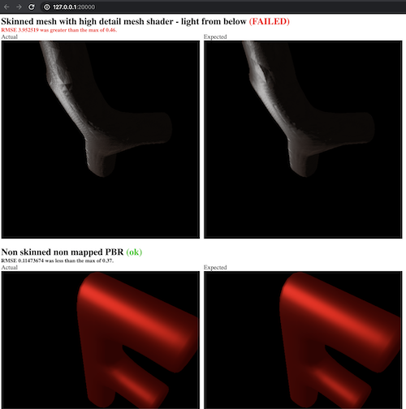

- Show quick start example demonstrating how to write a test suite and
  visualize it using the provided html visualizer and https crate.
  - A conformance test for a basic 2D renderer sitting on an RGBA Vec<u8>
    - "clear color" test
    - "solid rectangle" test
    - "view_html" metadata uses data image PNG

- Comes with two visualize general purpose, simple and HTML
  - Show screenshots of both
  - You can create your own ways to process or visualize test results


# conformer [](https://github.com/chinedufn/conformer/actions) [](https://docs.rs/conformer)

> conformer helps you write and visualize conformance test suites.

## Background / Initial Motivation

I have a cross platform renderer.

At a high level it is a `Renderer` trait and then a few different structs that `impl Renderer for Self`.

Since mid February 2020 I've been using a test suite to assert that all of my renderers work properly when
called with different `RenderGraph`s.

During May 2021 I was working on cleaning this conformance testing code and decided to pull it out into an open
source library in case it helps others with writing their own conformance test suites.

## Usage

At this time, the best way to get started with conformer is to check out the [example where we test a simple renderer](./examples/renderer-test-suite).

## Visualizing

conformer comes bundles with two ways to visualize your test results.

### Simple Visual

The simple visualizer is useful for writing results to stdout.

```
Metal Graphics API Renderer Tests
Test the renderer.

25 test results
Renderer should use the desired clear color ... ok
Renderer should render a textured quad using a sub-section of a specified texture ... ok
Resize framebuffer depth texture ... ok
Render UI quad with solid background ... ok
Render two textured quads from different atlases ... FAILED
Render two textured quads from the same atlas ... ok
UI quads Z ... ok
Render mock text glyph quad using single component texture ... FAILED
Render disks using triangle strips ... ok
Resize framebuffer color texture ... ok
Renderer should update a sub-section of a texture on the GPU. ... ok
Render 3 particles ... FAILED
Non skinned mesh with high detail mesh shader - light from above ... FAILED
# ...
# ... REMOVED FOR README BREVITY ...
# ...

test result: FAILED. 11 passed; 14 failed
thread 'renderer_tests' panicked at 'FAILED', crates/renderer-test/src/lib.rs:199:9
note: run with `RUST_BACKTRACE=1` environment variable to display a backtrace

failures:
    renderer_tests

test result: FAILED. 0 passed; 1 failed; 0 ignored; 0 measured; 0 filtered out; finished in 2.61s
```

### HTML Visual

The HTML visualizer is useful when you want to be able to see why a test failed.

It's flexible in that you can generate any HTML you like in order to best visualize your test case,
and it just wraps it with basic information like the test's title, description and whether or not
it passed or failed.



## To Test

To run the test suite.

```sh
# Clone the repository
git clone git@github.com:chinedufn/conformer.git
cd conformer

# Run tests
cargo test --all
```

## License

conformer is licensed under either of

- Apache License, Version 2.0 ([LICENSE-APACHE][apache] or http://apache.org/licenses/LICENSE-2.0)
- MIT license ([LICENSE-MIT][mit] or http://opensource.org/licenses/MIT)

[apache]: ./LICENSE-APACHE
[mit]: ./LICENSE-MIT
