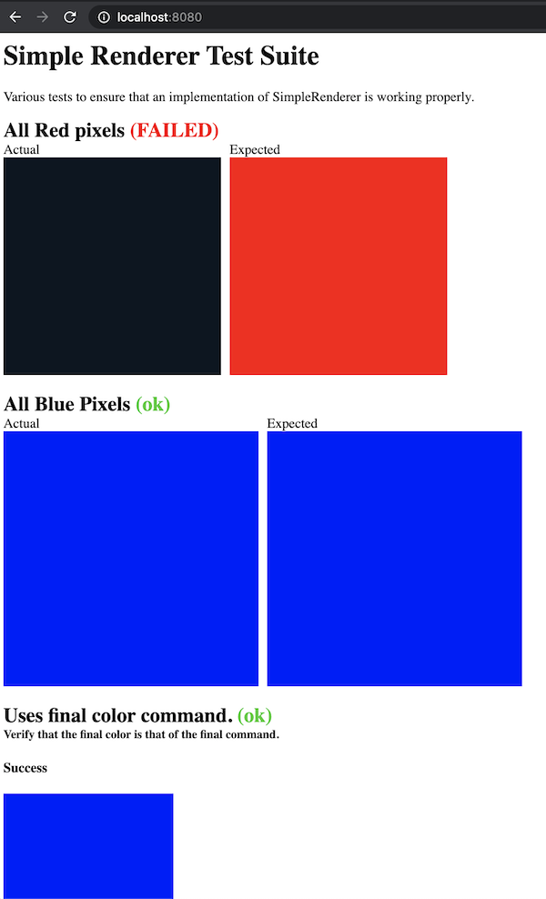

# Renderer Test Suite

This example demonstrates how you might go about building a conformance test suite for a renderer.

We use a trait called `SimpleRenderer`, and then create a test suite that verifies that a
`Box<dyn SimpleRenderer>` works as expected.

Anyone that implements `SimpleRenderer` can then use the conformance test suite to verify that their
implementation works as expected.

## To Run

```
git clone git@github.com:chinedufn/conformer.git && cd conformer
cargo run -p renderer-test-suite
```

## Generated HTML Screenshot



## Command Line Output

```
$ cargo run -p renderer-test-suite

Simple Renderer Test Suite
Various tests to ensure that an implementation of SimpleRenderer is working properly.

3 test results
All Red pixels ... FAILED
All Blue Pixels ... ok
Uses final color command. ... ok

test result: FAILED. 2 passed; 1 failed
HTML test suite visual written to:
/path/to/conformer/examples/renderer-test-suite/../../target/html-visual/index.html

You can visualize with any http server such as:

cd target/html-visual
python -m SimpleHTTPServer 8080
open http://localhost:8000
```
